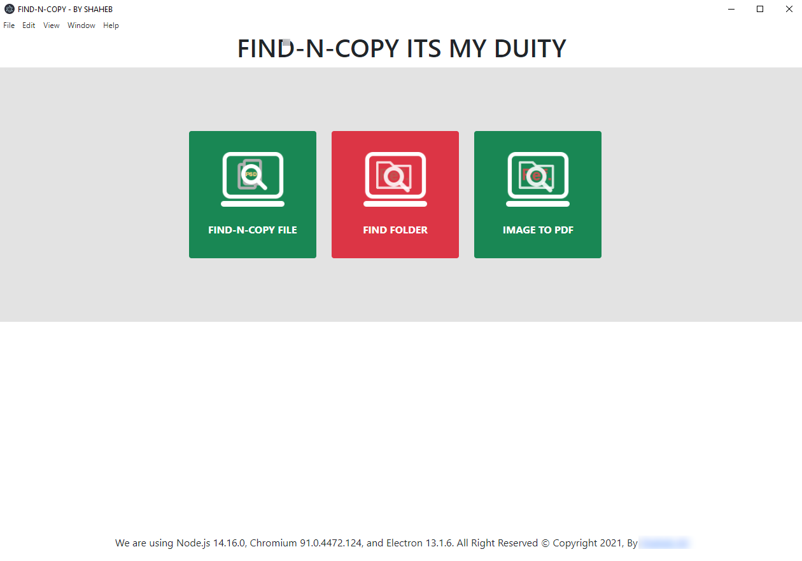
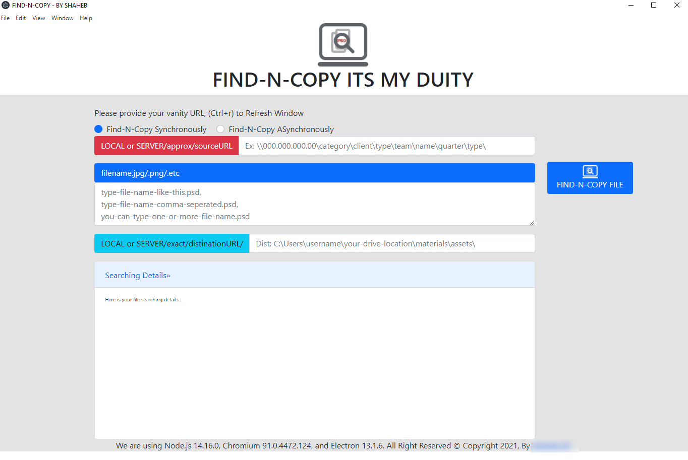
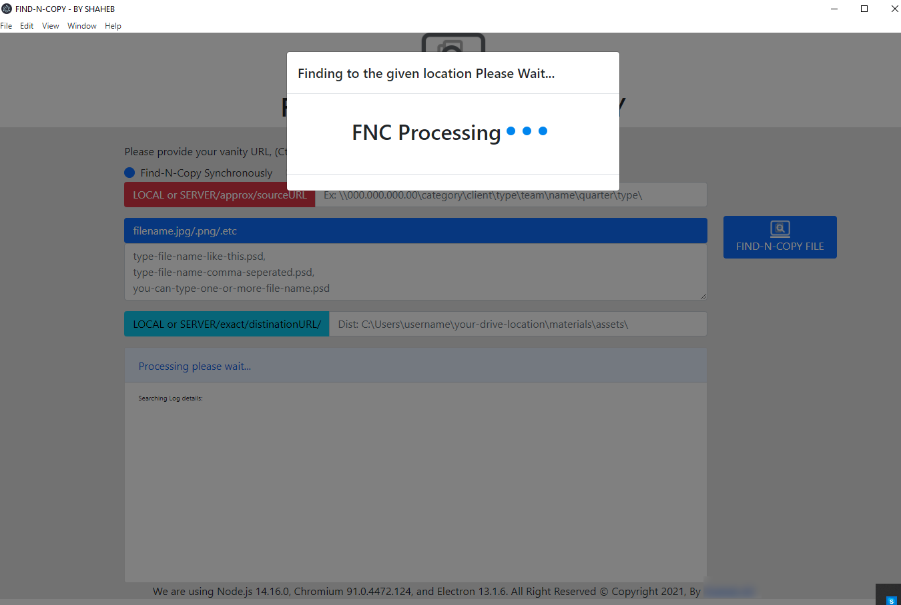
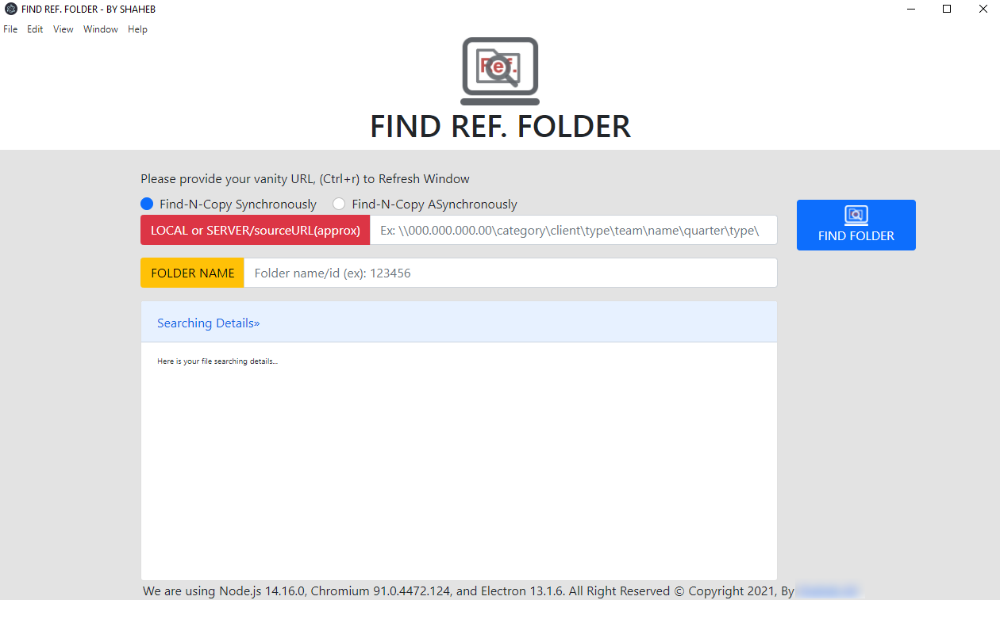
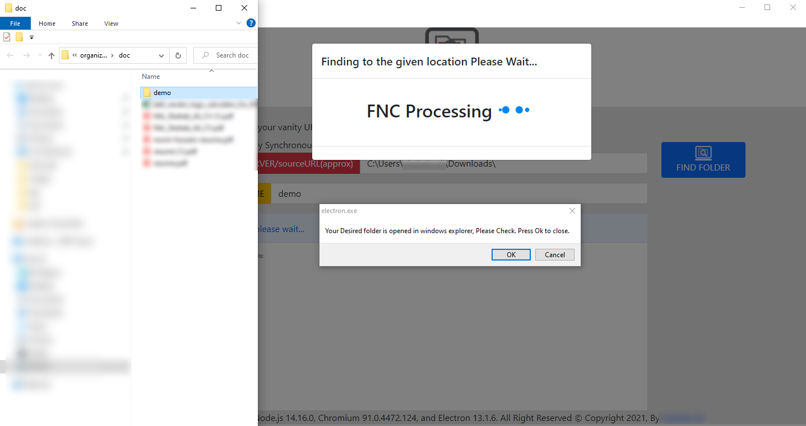
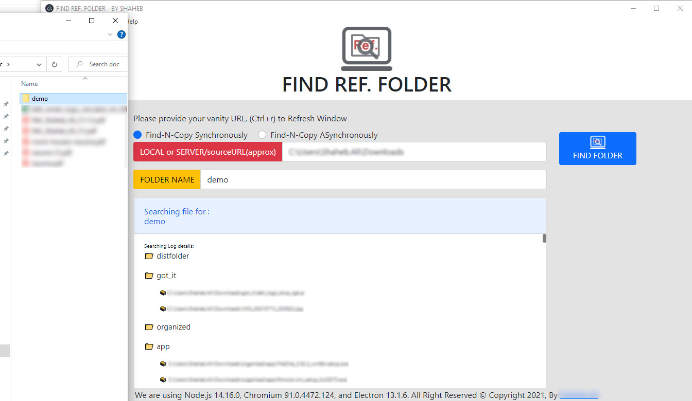
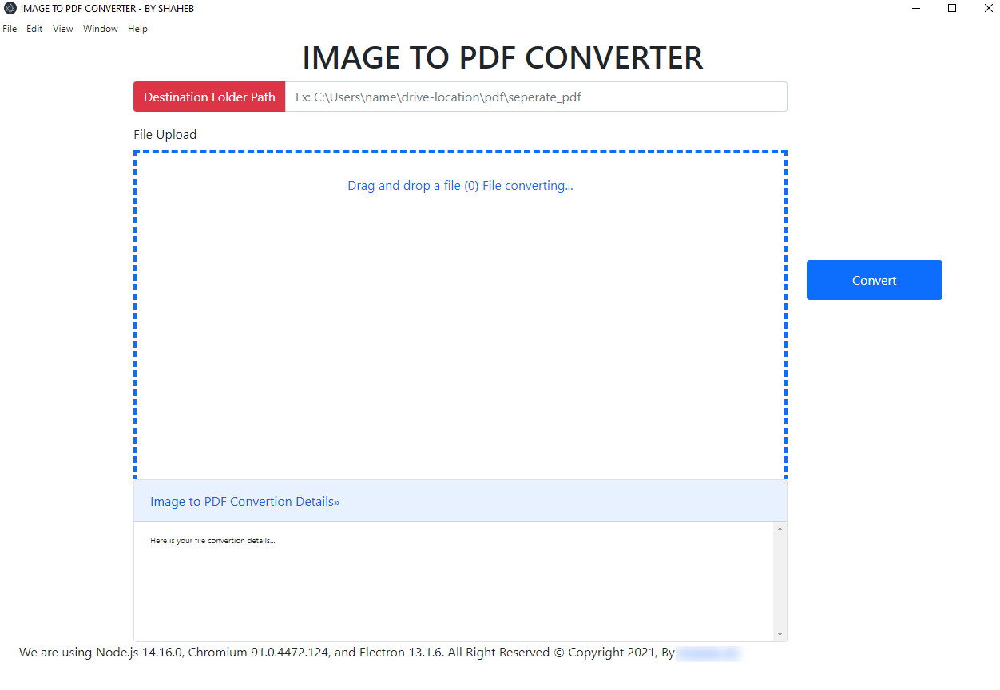
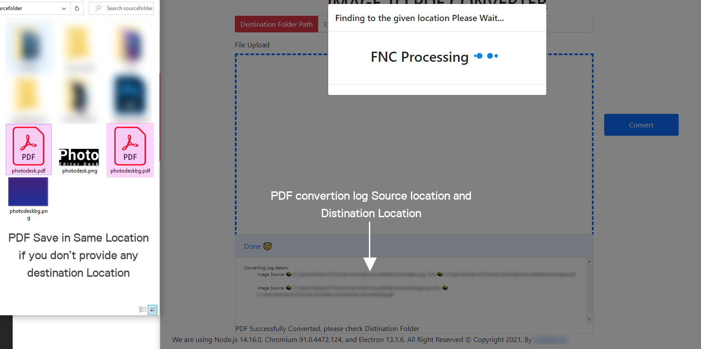

# Getting Started with FindNCopy NodeJs ElectronJs Desktop App

This project was bootstrapped with **NodeJs and ElectronJs**
## Available Scripts

In the project directory, you can run:

    "start": "electron-forge start",
    "dev": "electron index.js",
    "package": "electron-forge package",
    "make": "electron-forge make",
    "cli":"node cli.js"

### `npm run cli`
Runs the app in the Commandline mode.\

You will be asked to provide Source URL, Filename.etc, Destination.\
Boom! Enjoy!

### `npm start`

Runs the app in the development mode.\
will Open BrowserWindow to view it in the browser.

After Edit ( Ctrl + r ) The page will reload.\
You will also see any lint errors in the console.

### `npm run dev`

Runs the app in the development mode.\
will Open BrowserWindow to view it in the browser.

After Edit ( Ctrl + r ) The page will reload.\
You will also see any lint errors in the console.

### `npm run make`

Builds the app for production to the `out` folder.\
It correctly bundles operating system(Window) in production mode and optimizes the `out` for the best performance.

The `out` is minified and the filenames include the hashes.\
Your app is ready to play!

See the section about [deployment].

### `npm run package`

**Note: this is a one-way operation. Once you `package`, you can’t go back!**

If you aren’t satisfied with the build tool and configuration choices, you can `package` at any time. This command will remove the single build dependency from your project.

Instead, it will copy all the configuration files and the transitive dependencies (webpack, Babel, ESLint, etc) right into your project so you have full control over them. All of the commands except `package` will still work, but they will point to the copied scripts so you can tweak them. At this point you’re on your own.

You don’t have to ever use `package`. The curated feature set is suitable for small and middle deployments, and you shouldn’t feel obligated to use this feature. However we understand that this tool wouldn’t be useful if you couldn’t customize it when you are ready for it.
 
# Have a look few screenshot for your information

## Find Your Desired file (Single or Multiple) from your system or Local Server

### Provide Approx Source Path (Not Exact)
### Provide Comma seperated file name
### Provide Destination URL

### Searching Files and Copying...

### Find Your Desired Folder from your System

### Searching Desired Folder...

### Once Done, it will show your desired folder in windows explorer

### Drag and Drop Image to PDF convertion

### Save PDF in Save Location if you dont provide Dist Path

